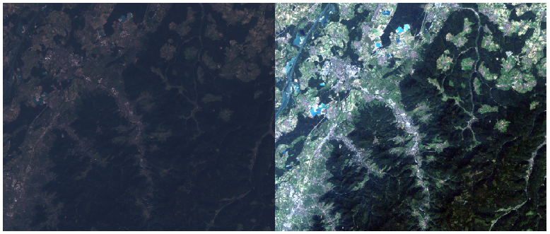
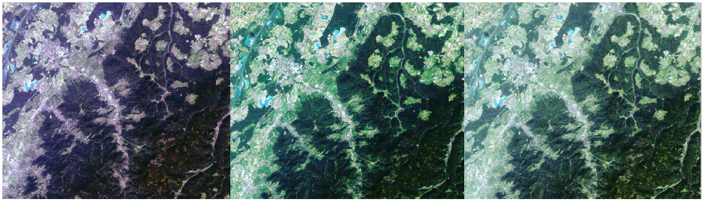
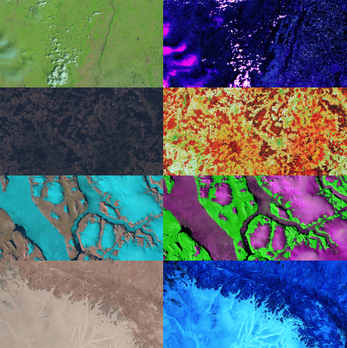
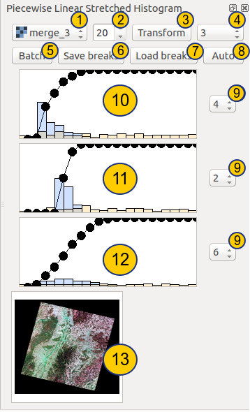

.. PLCS documentation master file, created by
   sphinx-quickstart on Sun Feb 12 17:11:03 2012.
   You can adapt this file completely to your liking, but it should at least
   contain the root `toctree` directive.

Welcome to PLCS's documentation!
============================================

.. index:: For what is it usefull

For what is it usefull ?
========================

PLCS allows you to manipulate how data from your raster are displayed in the most freely manner. You can enhance the overall contrast, but also transform your image such as a particular feature will be highlighted. PLCS will not improve the quality of information of your image, nor will extract information from them. All is about displaying the information present. On the next image, you can observe some examples.

Original image, raw on the left, with min-max stretched on the right

Image transformed by the PLCS, with 3 slightly different breaklists.

On the next image, you can appreciate a more artistic manner to transform raster images trough the PLCS

.. index:: Piecewise linear stretch

Piecewise - linear -  stretch
=============================

A good description of the process is describe in the next website. Neither the site nor the authors have no relationship with the plugin.
http://www.r-s-c-c.org/node/244

A linear transformation from a real X to a real Y can be mathematically written Y = a * X + b. Geometrically, the transformation can be seen as a straight line, with "a" being the slope and "b" the intercept. 

A Piecewise linear transformation is not linear. It's only linear on limited segments and each end of a linear segment is also the beginning of the next linear segment. The points standing at the end of two linear segments is called a "break point". Because it looks like a break when we draw the transformation. 

By adding a break point at the beginning of the first segment and at the end of the last segment, we can completely define the transformation trough the break point list, that will will called the breaklist.

Finally, the word "stretch" is used to describe the dispertion of LUT value on the whole range from 0 to 255. The histogram looks like stretched to the side. One has to keep in mind that no information will be created during the transformation process. So it's normal to have picked histogram after the transformation... Imagine a streching transformation with values from 100 to 120 which are stretched to 0 255: the value 119 my be sent to 210 and the value 120 may be sent to 255. No data can be present between both from 210 to 255. So the resulting histogramm will looks picked.

.. index:: How to use the plugin

How to use the plugin
========================

1. Combobox for selected one of the raster layer currently loaded in QGIS
2. Number of bar in the histogram. It's also the number of break used by the Auto algorithm.
3. Transform the selected raster with the current breaklists, saving it to the name and path provided and load it at the end.
4. Number of canals used to display the raster. It can take the value of 1 or 3.
5. Open the Batch dialog. It transform all tiff raster found in the folder, and recursively, with the current breaklists.
6. Save the current breaklists in an xml file.
7. Load a saved xml with breaklists.
8. Generate breaklists with an automated algorithms, which spread uniformly the LUT value over the range 0-255.
9. Selection of the layer band for the corresponding color channel
10. Histogram of the selected band. This first histogram correspond to the blue channel
  * Drag break point for changing the transformation
  * Right-click on the line for adding a break point
  * Right-click on a break point for removing it (Can be a little bit rough)
11. This second histogram correspond to the green channel
12. This second histogram correspond to the red channel
13. Preview 

.. toctree::
   :maxdepth: 2

